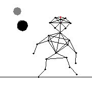

# Hansje, Verlet integration experiment

Copyright (c) Rick Companje, 2005
Licenced under GPLv3 licence. http://www.companje.nl

This is one of my first Processing sketches experimenting with 'Verlet' integration ([wikipedia](https://en.wikipedia.org/wiki/Verlet_integration)).

Points are defined and connected with 'Constraints'. Many small integration steps apply different forces to the velocity and position of the points.

