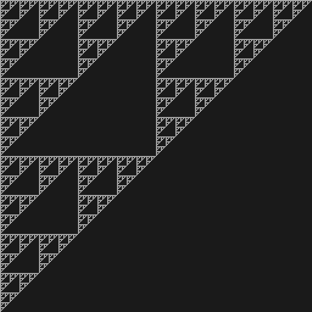

# Sierpinski triangle (using binary logic) with just 3 lines of code 

Copyright (c) Rick Companje, 2007-01-18. Licenced under GPLv3 licence. http://www.companje.nl

https://en.wikipedia.org/wiki/Sierpinski_triangle



```Processing
void setup() {
  size(256,256);
  
  for(int x=0; x<width; x++)
    for(int y=0; y<height; y++)
      if ((x&y)!=0) point(x,y);
}
```