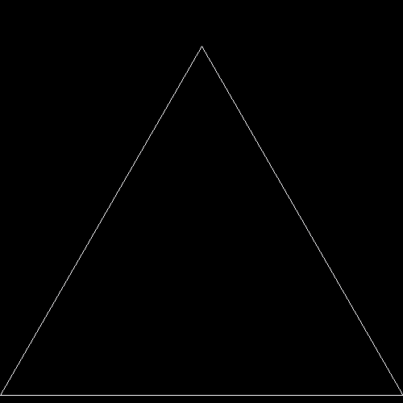

# Sierpinski Triangle (using L-System)

Copyright (c) Rick Companje, 2007-01-18. Licenced under GPLv3 licence. http://www.companje.nl

https://en.wikipedia.org/wiki/Sierpinski_triangle



```Processing
// Sierpinski Triangle using L-System, 
// 2007-01-18 by Rick Companje 

int gen = 0;

void setup() {
  size(200,200);
  frameRate(4);
  stroke(255);
}

void draw() {
  float angle = radians(120);
  float len = width;
  String axiom = "F+F+F";

  background(0);
  translate(width,height-10);
  rotate(HALF_PI);
  
  for (int i=0; i < gen; i++) {
    axiom = axiom.replaceAll("F","F+F-F-F+F");
    len/=2;
  }

  for (int i=0; i < axiom.length(); i++) {
    switch (axiom.charAt(i)) {
      case 'F': line(0,0,0,len); translate(0,len); break;
      case '+': rotate(angle); break;
      case '-': rotate(-angle); break;
    }
  }
  
  if (gen++ > 5) gen=0;
}
```

The animated GIF was made with the saveFrame function followed by the following `ffmpeg` command:
```
ffmpeg -r 2 -i screen-%04d.tif -y Sierpinski_Triangle_LSystem.gif
```