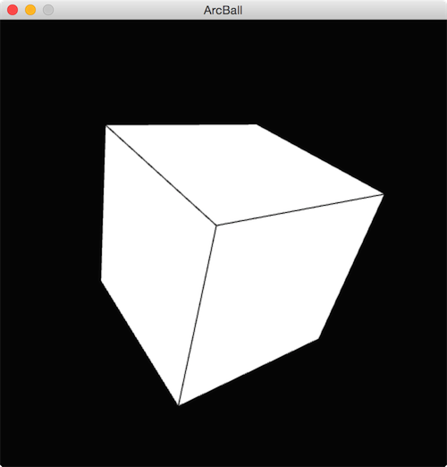

Copyright (c) Rick Companje, June 9th 2015 Licenced under GPLv3 licence. http://www.companje.nl

This Processing example shows how to rotate an object using the ArcBall principle. It introduces a simplified Quaternion class.

