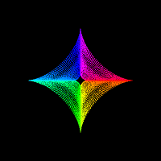

# Astroidal Ellipsoid

Copyright (c) Rick Companje, 2006-01-06. Licenced under GPLv3 licence. http://www.companje.nl

> "... the surface which is the inverse of the 'ellipsoid' in the sense that it 'goes in' where the ellipsoid 'goes out'" http://mathworld.wolfram.com/AstroidalEllipsoid.html



```Processing
//Astroidal Ellipsoid: 2006-01-06 by Rick Companje

float x,y,z,r=50;
float xr, yr, xrto, yrto;
int a=4,b=4,c=4;

void setup() {
  size(200,200,P3D);
  colorMode(HSB,1);
  smooth();
}

void draw() {
  background(0);
  translate(width/2,height/2);  
  doRotation();
  
  for (float u=0; u<TWO_PI; u+=.025) {
    stroke(u/TWO_PI,1,1);
    for (float v=-1; v<1; v+=.05) {
      x=pow(a*cos(u)*cos(v),3);
      y=pow(b*sin(u)*cos(v),3);
      z=pow(c*sin(v),3);
      point(x,y,z);
    }
  }
  //saveFrame("data/screenshot-####.png");
}

void keyPressed() {
  switch (key) {
    case 'A': a--; break;
    case 'B': b--; break;
    case 'C': c--; break;
    case 'a': a++; break;
    case 'b': b++; break;
    case 'c': c++; break;
  }
}

void doRotation() {
  r = mousePressed ? dist(width/2,height/2,mouseX,mouseY) : r;
  xrto = mouseX/float(width) * TWO_PI;
  yrto = mouseY/float(height) * TWO_PI;
  xr = abs(xr-xrto)>.01 ? xr-(xr-xrto)/4 : xr;
  yr = abs(yr-yrto)>.01 ? yr-(yr-yrto)/4 : yr;
  rotateX(-yr); 
  rotateY(-xr);
}
```
