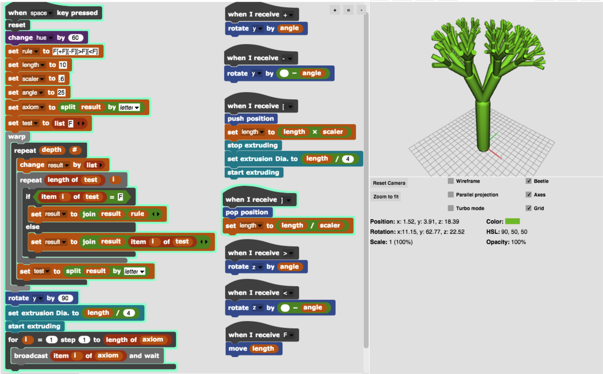
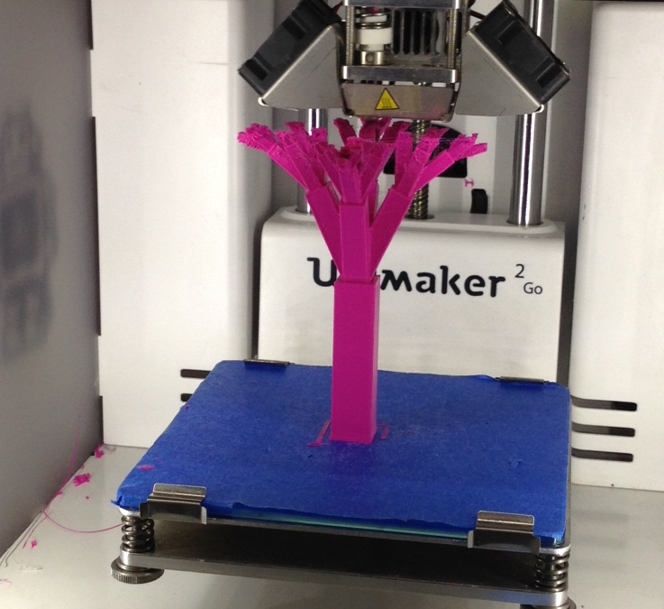

# L-Systems Tree in 3D

Inspired by lsys3D12 by Eric Rosenbaum. Also some great stuff on L-Systems in Chapter 8 of Daniel Shiffman's Nature of Code book. And ofcourse the 'The Alogirthmic Beauty of Plants' book.

https://en.wikipedia.org/wiki/L-system


Created by Rick Companje, 2015-08-10. Licenced under GPLv3 licence. http://www.companje.nl

```Processing
// L-System Tree in 3D
// 2015-08-10 by Rick Companje 

String axiom = "F";
float angle = radians(35);
float startLength = 140;
float len = startLength;
float scaler = .65;

void setup() {
  size(500,500,P3D);
  colorMode(HSB);
  noStroke();
  
  for (int i=0; i < 6; i++) {
    axiom = axiom.replaceAll("F","F[+F][-F][>F][<F]");
  }
}

void draw() {
  background(0);
  lights();
  translate(width/2,height-50);
  rotateY(frameCount/100.);

  for (int i=0; i < axiom.length(); i++) {
    switch (axiom.charAt(i)) {
      case '+': rotateX(angle); break;
      case '-': rotateX(-angle); break;
      case '[': pushMatrix(); len*=scaler; break;
      case ']': popMatrix(); len/=scaler; break;
      case '>': rotateZ(angle); break;
      case '<': rotateZ(-angle); break;
      case 'F': 
        translate(0,len/-2); 
        fill(60,255-len/startLength*255,255);
        box(len/4,len,len/4); 
        translate(0,len/-2);
        break;
    }
  } 
}
```

The animated GIF was made with the `saveFrame` function followed by the following `ffmpeg` command:
```
ffmpeg -i screen-%04d.tif LSystems_Tree.gif
```

# L-Systems Tree in 3D created with BeetleBlocks
Today August 11, 2015 I attended the BeetleBlocks Masterclass by Eric Rosenbaum (MIT) at Waag Society in Amsterdam.
Even though I had never really used BeetleBlocks (nor Scratch or Snap! before) I managed to port the above L-Systems visualization of the 3D tree.



Michael Lodi from Italy (https://twitter.com/ldomhl) and I managed to 3D-print the first L-System ever made in BeetleBlocks on the Ultimaker 2 GO!


